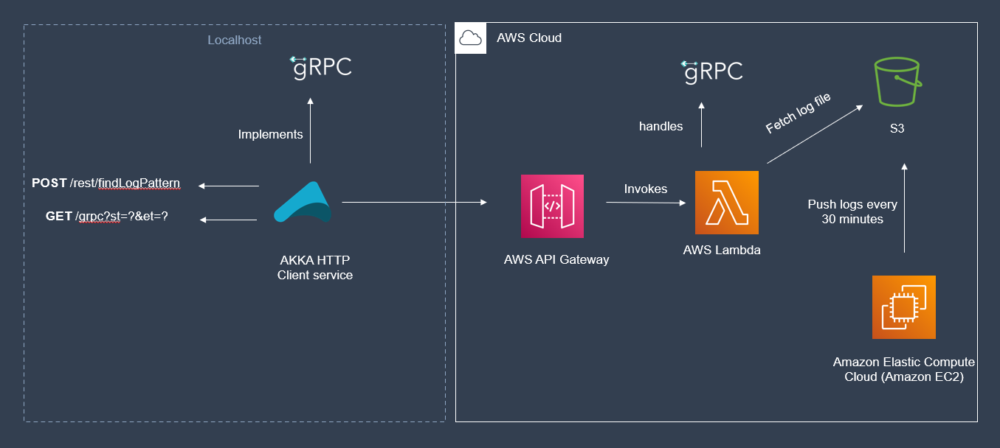

### Project Architecture

The Figure above illustrates the implemented architecture of this project.

The implementation consists of the localhost AKKA service that exposes Rest apis and redirects calls to the AWS api gateway.
The AWS API gateway further invokes a lambda function that executes the business logic to determine if logs are present within a specified timespan and returns the appropriate response.
The Lambda functions has access to S3 buckets from where logs are Fetched. The Logs themselves are continuously generated and uploaded to s3 by a LogGenerator deployed on an EC2 instance where a cron job is configured to run the log generator every 30 minutes.

Grpc is used on the localhost client as well as in the lambda function inorder to handle GRPC style requests.

In the Akka service, an implementation of the generated GRPC class is created [GrpcService](../AkkaService/src/main/scala/com/ajsa/service/GrpcService.scala), that abstracts the functionality to be performed within the GRPC service.
This class simply receives the grpc request object and send the appropriate request to the API Gateway and responds with the corresponding GPRC response object.

Requests sent to the API gateway in the GRPC format are first marshalled into JSON before they are sent.

On the Lambda function, The JSON input received is checked to see if it's a GRPC request or and if so, the JSON input received in the lambda is again unmarshalled into the corresponding GRPC class object before sending it to the server side GRPC class implementation that handles the GRPC request.

### EC2 Log Generation.

The [Log Generator](https://github.com/ajaysagarn/LogFileGenerator) is deployed to an EC2 instance. A [build script](https://github.com/ajaysagarn/LogFileGenerator/blob/main/build.sh) has been added to the log generator which consists of the commands that need to be executed inorder to run the log generator as well as to move the log file from the ec2 instace to the s3 bucket using the aws CLI.
This script is then executed by a cron s=job within the VM every 30 minutes which generates and stores the logs to S3.

### Lambda API Gateway specification:-

The Lambda function is publicly exposed via a the API gateway which exposes a POST call. This single API call is dynamic in the sense that the payload accepts the format in which the API call must be handled.
A Same API request body that needs to be sent to the POST API is as follows

    {
        "type": "GRPC", //GRPC or REST
        "input": {
            "st": "00:45", //the starting time
            "et": "01:00", //the duration from the start time
            "pattern": "ABC+*" // optional paramater that specifies the pattern to be matched.
                                //If supplied, the lambda function searches and returns matches to the pattern within the given time range
        }
    }         

When the ``type`` parameter within the payload is GRPC, the grpc generated classes are used to convert the json payload into the appropriate GRPC class objects and then passed as input to an implementation of
the GRPC service that performs the required business logic and returns the appropriate GRPC response.

In case the ``type`` parameter is within REST, the input is used as is to execute the required business logic and a JSON response is given back to the client.

The ``pattern`` attribute is optional and is only used in REST requests wherein, if the parameter field is provided, the lambda function not only determines if the logs exist in the time range, but also looks for
matches within the time range for the pattern and returns a list all the matched messages back to the client.

#### Response Codes : 
    200 -> logs found
    404 -> logs not found
    400 -> bad request
    500 -> Internal server error

### Log search implementation:-

Here two types of binary search approaches have been tried each of which are explained below.

First, when a request is handled for GRPC requests, we only need to provide if the log file consists of logs within the given time range.

Inorder to implement this functionality we implement binary search as follows, 
1. We first obtain a BufferedInputStream for the S3 Object along with the file size (in number of bytes)
2. Using the file size value we first get the log timestamp at the middle of the file ie, at location (fileSize/2)
3. We then compare the timestamp with the required time range and decide which have of the file needs to be processed in the next iteratino.
4. This way we obtain a log(n) way to find if the log file has logs within a given timestamp in it.
5. Here we do not bring the entire file into the memory but instead we use Java Bufferedreaders to skip over the required number of bytes in the file to reach the middle of the file
and only read the line at that position.

When requests are handles in REST style, we first need to check if the log file has logs in the given time range, next if the payload has a pattern, we also need to match the log messages with the given pattern
and return a list of matched messages to the client.

Here we implement this functionality as follows:
1. Get the Inputstream of the object and load the entire log into a list in memory.
2. Next we perform a basic binary serach over this list to determine if the list of logs have entries within the given timestamp
3. Once we find a mid position that falls within the time range provided, we then use this position as a pivot to fetch another sub list of all the log messages in the time range.
4. To get such a sub list we span out on either side of the pivot position until we go out of the time range.
5. Once we obtain the list of all messages in the time range we run a generic regex match over the messages to get the final list of matched messages, which is then sent back to the client.

The above two implentations can be found in [LogSearchUtils](https://github.com/ajaysagarn/log-search/blob/main/GrpcRestLambda/src/main/scala/HelperUtils/LogSearchUtils.scala)

### Akka service API specification: 

The Akka service runs locally which exposes two REST API that function as a wrapper around the API gateway endpoint.

    GET /grpc?st=00:24&et=00:05
    POST /rest/findLogPattern

The GET call accepts a GRPC request wherein the API directive calls an implementaion of the GRPC generated class which then calls the API gateway endpoint by correctly marshalling the GRPC input supplied.
The response for this api is  `200` if there are logs within the time range and `404` if not.

The Post API call accepts the same payload that the API gateway accepts. Here the AKKA service simply forwards the request to the API gateway and returns the response received back to the client.
